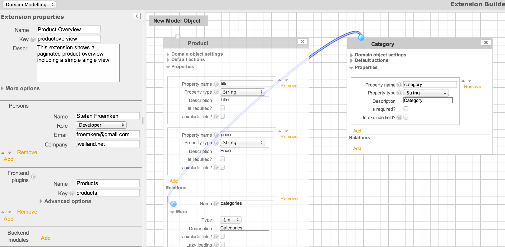

.. ==================================================
.. FOR YOUR INFORMATION
.. --------------------------------------------------
.. -*- coding: utf-8 -*- with BOM. ÄÖÜäöüß

.. include:: Includes.txt

Erstellen einer Extbase Extension
=================================

Die erste Extension - Schritt fuer Schritt
------------------------------------------

Ihr müsst Euch zu aller erst von dem Gedanken der alten piBase-Programmierung lösen und begreifen,
dass die Programmierung auf Extbase nicht direkt mit Quellcode beginnt, sondern schon während dem Gespräch mit dem
Kunden. Als Programmierer muss klar sein, was der Kunde will. Je besser Ihr ihn versteht,
desto besser könnt Ihr planen und Planung ist für Extbaseprogrammierung das A und O.

Im folgenden Verlauf werdet Ihr eine Produktübersicht erstellen, bei der auf der ersten Seite die Produkte
als Liste dargestellt werden und nach einem Klick auf den Produkttitel in die Detailansicht gewechselt wird. Da die
Anzahl der Produkte stark variieren kann, wird es eine Seitennavigation geben, mit der der Webseitenbesucher durch die
Produkte navigieren kann.

.. tip::

   Auf Grund von Mehrsprachigkeit solltet Ihr alle Datenbankspalten in englischer Sprache anlegen. Spalten wie
   *ist_gefraessig* sind einfach sehr schlecht zu lesen.

Den Extension Builder installieren
----------------------------------

Um eine Extension auf Basis von Extbase zu erstellen, müsst Ihr den Extension Builder (extension_builder) über den
Extension Manager installieren. Ihr erhaltet nach der Aktivierung dieser Extension einen neuen Eintrag *Extension
Builder* in der linken Menüleiste des TYPO3-Backends. Nach einem Klick auf diesen neuen Eintrag landet Ihr auf der
Einstiegsseite des *Extension Builders*, die Euch erst mal ein paar grundsätzliche Dinge erklärt. Über die Selectbox
oben könnt Ihr zwischen der *Einstiegsseite* und dem *Domain Modelling* wechseln.

Informationen zur Extension eingeben
------------------------------------

Nach der Auswahl von *Domain Modelling* aus der Selectbox, erscheint nun ein Formular in dem Ihr weitere
Informationen zu der Extension angeben könnt und eine weiße karierte Fläche.

Tragt nun folgende Daten in das Formular ein:

- Name: Product Overview

- Key: productoverview

- description: This extension shows a paginated product overview including a simple single view

- persons: Tragt hier Eure Daten ein.

- Frontend Plugin:

  * Name: Products

  * Key: products

Den Pluginnamem findet Ihr später in der Selectbox für die Plugins innerhalb der Seiteninhalte wieder. Der Pluginkey
wird von Extbase mit dem Extensionkey zusammengesetzt und bildet so einen TYPO3 weiten eindeutigen Bezeichner:
productoverview_products

Domain Modelle anlegen
----------------------

Das Formular für die Extensionkonfiguration könnt Ihr mit dem kleinen Pfeil oben rechts im Formular schließen. Nun
steht Euch die komplette karierte Fläche zur weiteren Bearbeitung zur Verfügung. Per Drag and Drop könnt Ihr nun
aus dem Kasten "New Model Object" ein eigenes Domainmodel herausziehen und auf der weißen Fläche platzieren. Dieses
Model nennt Ihr "Product". Nach dem Aufklappen der *Domain Object Settings* aktiviert Ihr die Checkbox *Is
Aggregate Root* und setzt die Beschreibung auf "Product".

Aktiviert bei den *Default Actions" die beiden Checkboxen: *list* und *show*

Legt 2 Eigenschaften vom Typ *String* an: title und price

Für die Verknüpfung zu den Kategorien müsst Ihr noch eine Relation anlegen. Klickt auf *Add* und tragt als name
"categories" ein. Da mehrere Kategorien möglich sein sollen wählt Ihr auf der Selectbox "1:N" aus.

Legt nun ein weiteres Domainmodel an und benennt es "Category". Im Bereich der "Domain Object Settings" vergebt Ihr
diesmal nur eine description aber lasst die Checkbox "Aggregate Root" unmarkiert. Auch Actions werden für dieses
Domainmodel nicht benötigt.

Legt 1 Eigenschaft vom Typ String an: category

Im Domainmodel *Product* könnt Ihr nun von der Relation *category* eine Linie zu dem Model *Category* ziehen.

Extension aktivieren
--------------------

Geht nun in den Extension Manager und aktiviert die Extension *productoverview*. Bei diesem Vorgang werden auch die
fehlenden Datenbanktabellen erstellt.

Plugin einbinden
----------------

Legt eine neue Seite an und bindet das neu erstellte Plugin mit dem Namen "Product" auf Eurer Seite ein. Wenn alles
geklappt hat, dann erscheint im Frontend eine leere Tabelle mit den beiden Tabellen-Überschriften *title* und *price*.

Datensätze anlegen
------------------

Legt im TYPO3-Seitenbaum eine neue Seite vom Typ *Ordner* an. Auf dieser Seite könnt Ihr nun neue Datensätze vom Typ
*Product* erstellen. Damit diese Daten in Eurem Plugin angezeigt werden, müsst Ihr diesem mitteilen,
wo sich die Daten befinden. Geht dazu in Euer Plugin auf den Tab *Verhalten*. Tragt im Bereich *Datensatzsammlung*
die uid der Seite mit den Product-Datensätze ein. Nun erscheinen die Datensätze auch im Frontend

Designanpassungen
-----------------

Jede Extension, die über den Extension Builder erstellt wurde bringt ein kleines CSS mit. Derzeit sind die
Tabellenspalten extremst eng beieinander. Erstellt nun ein +extTemplate für Eure Seite und bindet das Extension
Template von Eurer Extension ein. Danach erscheint Eure Tabelle ein wenig aufgeräumter.

Viel Spaß mit Eurer ersten Extbase Extension
